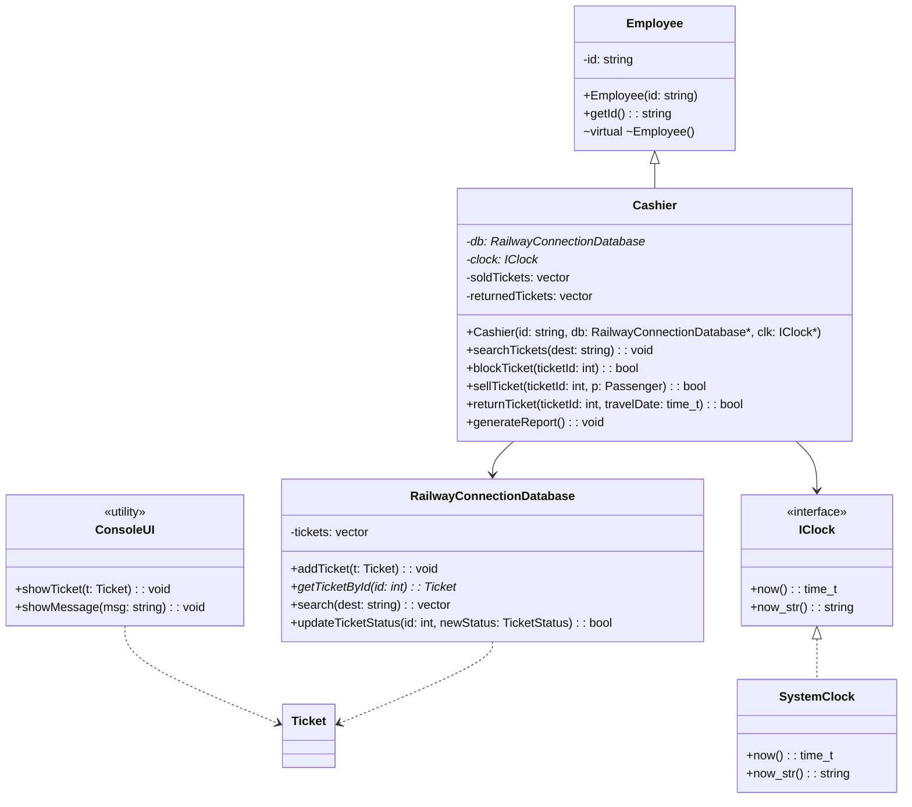
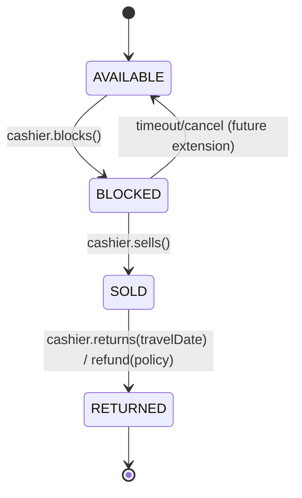
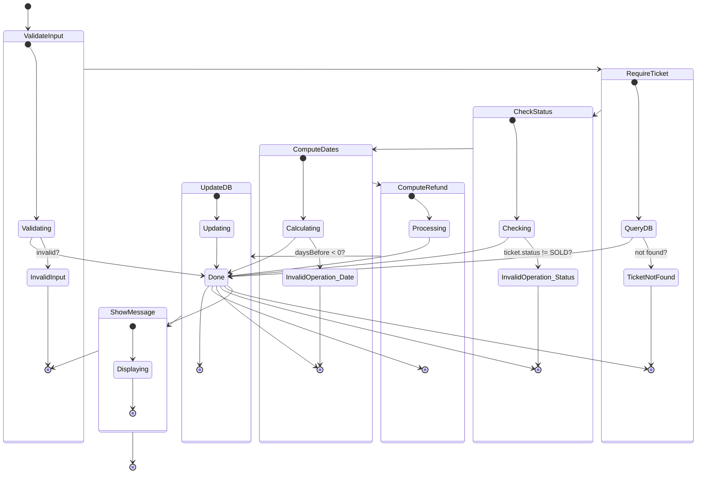
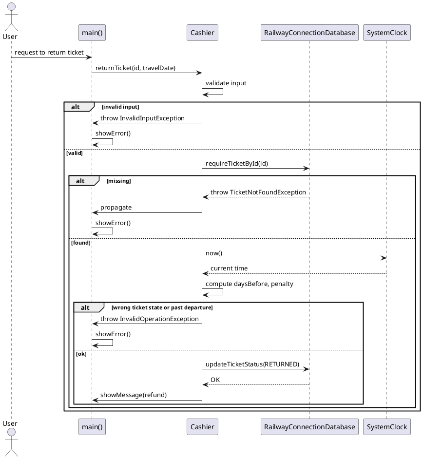


# Rail Tickets System — Detailed Level Design (DLD)

  

> Version: 3.0

> Created by: Kamil Błasiak

  

---

  

## 1) System Architecture Overview

  

### Layered View

-  **UI Layer (Presentation)**

-  `ConsoleUI` renders tickets and messages to stdout. Responsibilities: formatting domain objects for display, no business logic.

-  **Logic Layer (Application / Domain)**

-  `Cashier` orchestrates user-facing actions: search, block, sell, return, and reporting. Applies validation and state transition rules.

-  `IClock` (abstraction) and `SystemClock` (implementation) provide current time and a human-readable timestamp string for reporting.

-  **Data Layer (Persistence / Access)**

-  `RailwayConnectionDatabase` manages `Ticket` storage in-memory, lookup, search, and status updates.

-  **Types (Shared Domain Model)**

- Value types and enums in `Types.hpp`: `Passenger`, `Ticket`, `CoachType`, `TicketStatus`.

  

### Runtime Interaction (Happy-path)

1. Cashier requests a search from DB → DB returns available tickets matching destination → UI prints.

2. Cashier blocks a selected ticket → DB updates status → UI acknowledges.

3. Cashier sells a previously blocked ticket to a passenger → DB updates → UI confirms.

4. Cashier returns a sold ticket given a future travel date → `IClock` supplies now() → policy calculates penalty → DB marks returned → UI prints refund.

  

---

  

## 2) UML Class Diagram (attributes & methods)

  



  

> Notes:

> -  `Employee` is a base class for `Cashier`.

> -  `ConsoleUI` is stateless and offers static rendering helpers.

> - The DB holds `Ticket` entities in-memory; IDs are unique.

  

---

  

## 3) State Diagram — Ticket Lifecycle

  



  

**Rules enforced in code:**

- Only **AVAILABLE → BLOCKED** is allowed when blocking.

- Only **BLOCKED → SOLD** is allowed when selling.

- Only **SOLD → RETURNED** is allowed when returning.

- Returning requires travelDate ≥ now().

  

---

  

## 4) Enumerations & Domain Types

  

```cpp

// Ticket status

enum  class  TicketStatus { AVAILABLE, BLOCKED, SOLD, RETURNED };

  

// Coach types

enum  class  CoachType { SLEEPER, COMPARTMENT, SEATER };

  

struct  Passenger { string name; string socialSecurityCode; };

  

struct  Ticket {

int id; string destination; string originStation; CoachType coachType;

double cost; TicketStatus status;

};

```

  

Validation and transition rules apply over `TicketStatus`.

  

---

  

## 5) Validation Rules & Policies

  

### 5.1 Blocking

-  **Preconditions**: Ticket exists, `status == AVAILABLE`.

-  **State transition**: `AVAILABLE → BLOCKED`.

-  **Postconditions**: DB reflects `BLOCKED`, UI confirmation output.

-  **Failure cases**: Missing ticket, or status ≠ `AVAILABLE` → reject with message.

  

### 5.2 Selling

-  **Preconditions**: Ticket exists, `status == BLOCKED`, passenger info present.

-  **State transition**: `BLOCKED → SOLD`.

-  **Postconditions**: DB reflects `SOLD`, cashier records ticketId in `soldTickets`.

-  **Failure cases**: Status ≠ `BLOCKED` → reject with message.

  

### 5.3 Returning & Refund Policy

-  **Preconditions**: Ticket exists, `status == SOLD`; `travelDate >= now()`.

-  **State transition**: `SOLD → RETURNED`.

-  **Penalty (by days before travel)**:

- ≥ 30 days → 1%

- ≥ 15 days → 5%

- ≥ 3 days → 10%

- < 3 days → 30%

-  **Refund**: `refund = cost * (1 - penaltyRate)` rounded as per output formatting rules (current code prints raw double). Future enhancement: format currency.

-  **Postconditions**: DB reflects `RETURNED`, cashier records ticketId in `returnedTickets`, UI shows refund and penalty.

-  **Failure cases**: Not SOLD, travel date in the past.

  

### 5.4 Searching

- Filters tickets where `destination == dest` and `status == AVAILABLE`.

  

---

  

## 6) Class & Method Specifications (DLD level)

  

### 6.1 `ConsoleUI` (UI Layer)

-  **Responsibility**: I/O formatting to console.

-  **Methods**:

-  `showTicket(const Ticket& t): void` — prints id, route, price, and textual status.

-  `showMessage(const std::string& msg): void` — prints informational or error messages.

  

### 6.2 `Employee`

-  **Responsibility**: Base identity for staff objects.

-  **Attributes**: `id: string`.

-  **Methods**: `getId(): string`.

  

### 6.3 `IClock` / `SystemClock`

-  **Responsibility**: Abstract wall-clock; concrete system time provider.

-  **Methods**:

-  `now(): time_t` — current epoch seconds.

-  `now_str(): string` — formatted `YYYY-MM-DD HH:MM:SS`.

  

### 6.4 `RailwayConnectionDatabase` (Data Layer)

-  **Responsibility**: In-memory repository for tickets.

-  **Attributes**: `tickets: vector<Ticket>`.

-  **Methods**:

-  `addTicket(const Ticket& t): void` — append.

-  `getTicketById(int id): Ticket*` — linear search, pointer or `nullptr`.

-  `search(const string& dest): vector<Ticket>` — filter by destination & AVAILABLE.

-  `updateTicketStatus(int id, TicketStatus newStatus): bool` — set status if found.

  

### 6.5 `Cashier` (Logic Layer)

-  **Responsibility**: Orchestrate ticket operations and report generation.

-  **Attributes**: `db`, `clock`, `soldTickets`, `returnedTickets`.

-  **Methods**:

-  `searchTickets(dest): void` — delegates to DB search, prints via UI.

-  `blockTicket(ticketId): bool` — enforce AVAILABLE→BLOCKED.

-  `sellTicket(ticketId, p): bool` — enforce BLOCKED→SOLD, log sale.

-  `returnTicket(ticketId, travelDate): bool` — enforce SOLD→RETURNED, compute refund.

-  `generateReport(): void` — print totals with timestamp.

  

---

  

## 7) File Structure Mapping (.hpp / .cpp)

  

```

Types.hpp // domain enums & structs

Employee.hpp // base class

IClock.hpp // clock interface

SystemClock.hpp // clock implementation (header-only)

ConsoleUI.hpp/.cpp // UI helpers

RailwayConnectionDatabase.hpp/.cpp // repository

Cashier.hpp/.cpp // application logic

main.cpp // wiring & scenario script

```

  

Build order example: `Types.hpp` → `Employee.hpp` → `IClock.hpp` & `SystemClock.hpp` → `RailwayConnectionDatabase.hpp/.cpp` → `ConsoleUI.hpp/.cpp` → `Cashier.hpp/.cpp` → `main.cpp`.

  

---

  

## 8) Traceability Matrix (Requirements → Design → Code)

  

| Req ID | Requirement | Design Element(s) | File(s) / API | Test/Usage in `main.cpp` |

|---|---|---|---|---|

| R1 | Console-based UI that prints tickets and messages | UI Layer / `ConsoleUI` | `showTicket`, `showMessage` | Search, block, sell, return logs |

| R2 | Cashier can search available tickets by destination | `Cashier.searchTickets` delegating to DB | `RailwayConnectionDatabase::search` | `cashier.searchTickets("Tallinn")` |

| R3 | Block only AVAILABLE tickets | Validation rule; `Cashier.blockTicket` | `getTicketById`, `updateTicketStatus(…, BLOCKED)` | `cashier.blockTicket(2)` |

| R4 | Sell only BLOCKED tickets | Validation rule; `Cashier.sellTicket` | `updateTicketStatus(…, SOLD)` | Attempt sell(3) fails; sell(2) succeeds |

| R5 | Return only SOLD tickets with penalty policy | Validation rule; `Cashier.returnTicket` + time abstraction | `IClock::now`, `updateTicketStatus(…, RETURNED)` | return(2, now+10d) → 10% penalty |

| R6 | Reporting with timestamp | `Cashier.generateReport` using `IClock::now_str` | `ConsoleUI::showMessage` | Final report printed |

| R7 | Data stored in-memory with CRUD-like ops | `RailwayConnectionDatabase` | `addTicket`, `getTicketById`, `search`, `updateTicketStatus` | Ticket setup + transitions |

  

## 9) Validation & Exception Handling

  

This release introduces **user input validation**, **domain validation**, and a structured **exception-handling mechanism**.

No structural or architectural changes were made to existing components.

  

## 9.1 Added Exception Classes

  

The following new exception classes were added in Release 3:

  

| Class | Purpose |

|-------|---------|

| `TicketException` | Base class for domain exceptions |

| `InvalidInputException` | Thrown when user input is syntactically invalid |

| `InvalidOperationException` | Thrown on business-rule violations (e.g. wrong ticket state) |

| `TicketNotFoundException` | Thrown when DB cannot find ticket by ID |

| `DataSourceException` | Reserved for future persistence layer |

  

**Source file added:**  `Exceptions.hpp`.

  

## 9.2 Validation Rules Added

  

### Input Validation (Logic Layer – Cashier)

  

-  `ticketId > 0`

-  `travelDate != 0`

- Destination must be non-empty (`searchTickets`)

- Passenger name + SSN must be non-empty (`sellTicket`)

  

### Business Rule Validation

  

Ticket states are now strictly enforced:

  

| Operation | Valid State | Invalid State → Exception |

|-----------|-------------|----------------------------|

| `blockTicket` | AVAILABLE | BLOCKED / SOLD / RETURNED |

| `sellTicket` | BLOCKED | all others |

| `returnTicket` | SOLD | AVAILABLE / BLOCKED / RETURNED |

  

### Time-Based Validation for Returns

  

```

daysBefore = floor((travelDate - now) / 86400)

```

  

If `daysBefore < 0` →

**InvalidOperationException: "Cannot return a ticket after departure"**

  

## 9.3 Penalty Calculation (now validated)

  

Penalty logic remains unchanged but is now enforced by validation:

  

| Days before departure | Penalty |

|-----------------------|---------|

| ≥ 30 | 1% |

| ≥ 15 | 5% |

| ≥ 3 | 10% |

| 0–2 | 30% |

| < 0 | invalid return |

  

Refund:

  

```

refund = cost * (1 - penaltyRate)

```

  

Implemented in: **`Cashier::computePenaltyRate()`**

  

# 10) Behavioural Model Updates (Release 3)

  

The required behavioural documentation has been added for one complete scenario:

  

### Chosen Scenario:

**Returning a SOLD ticket** using `Cashier::returnTicket(ticketId, travelDate)`.

  

## 10.1 Activity Diagram

  


  

## 10.2 Sequence Diagram

  



  

# 11) Exception Handling Policy

  

All exceptions thrown by Logic or Repository layers are caught at the UI level.

  

### 11.1 Example Handling in main.cpp

  

```cpp

catch (const TicketException& ex) {

ConsoleUI::showError(ex.what());

}

catch (const  std::exception& ex) {

ConsoleUI::showError(std::string("Unexpected error: ") +  ex.what());

}

```

  

### **11.2 Behaviour**

  

- Ticket state remains unchanged on exception.

- UI displays a clear error message.

- End-of-day report still executes.

